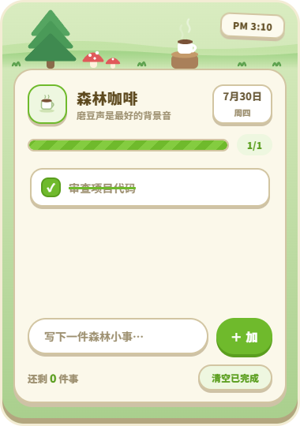

# 小岛待办事务所（animal-island-todo）

一款动森风待办桌面皮肤，适用于 [Driftlet](https://github.com/xiaochengzina/Driftlet) 1.0+（Windows 桌面皮肤管理器）。以透明无边框小窗常驻桌面，随手记录、勾选今日待办。

## 特性

- **5 套手绘风主题**：薄荷小岛 / 海浪假日 / 森林咖啡 / 星夜营地 / 沙漠绿洲，在「皮肤设置」页下拉切换，即时生效
- **手绘 SVG 场景带**：随窗口高度 `clamp` 收缩；窗口调小时自动隐藏装饰元素，保住任务列表功能完整
- **实时时钟标签**：场景栏显示当前时间，支持 12/24 小时制切换；跨午夜日期自动刷新
- **任务双向同步**：任务清单存 `settings.json`（`todolist` 控件）——皮肤里增删勾选经 `skin_set_setting` 写回，与管理器配置页实时同步
- **零权限**：不声明任何 `permissions`，不需要文件/网络/系统等敏感权限

## 安装

1. 到 [Releases](https://github.com/xiaochengzina/animal-island-todo/releases) 下载最新的 `.dskin` 文件，双击唤起 Driftlet 安装引导页；
2. 或把本仓库全部文件放入 `<Driftlet 安装目录>\skins\animal-island-todo\`，在管理器里点「刷新」。

## 致谢

本皮肤的视觉设计基于开源项目 **[animal-island-ui](https://github.com/guokaigdg/animal-island-ui)**（@guokaigdg）移植改造——一个动森风格的 React UI 组件库，灵感来源于任天堂《集合啦！动物森友会》的游戏视觉（另有 Vue 版同步发布）。感谢作者开源这套可爱的设计。

## 许可

GPL v3（与上游设计的使用场景保持一致，详见 [LICENSE](LICENSE)）。本皮肤为粉丝向作品，与任天堂无关；《集合啦！动物森友会》相关素材权利归任天堂所有。
